# Introducción

La seguridad de las comunicaciones digitales depende en gran medida de la criptografía, tanto para garantizar la confidencialidad de la información como para verificar la identidad de las partes que se comunican. En este laboratorio académico se aborda el estudio práctico de dos paradigmas fundamentales de cifrado —el simétrico y el asimétrico— y su aplicación conjunta en los certificados digitales que sustentan los protocolos SSL/TLS, base de la navegación web segura (HTTPS).

Con el objetivo de ir más allá de una explicación puramente teórica, se desarrolló una página web interactiva (HTML, CSS y JavaScript). Como cierre práctico, se implementó un servidor Node.js sobre el cual se aplicó un certificado digital generado y gestionado por mi mismo, permitiendo comprobar de primera mano el proceso de emisión, instalación y validación de un certificado SSL/TLS en un entorno local.

De esta manera, el ejercicio integra los conceptos teóricos de cifrado simétrico, cifrado asimétrico y certificación digital con su aplicación directa, evidenciando cómo estos mecanismos se combinan en la práctica para proteger las comunicaciones en internet.

## Herramientas

En este orden de ideas, vamos a usar las siguientes herramientas para generar el Certificado Digital:

- **mkcert** — CA local de desarrollo; genera el certificado que se aplica al servidor y lo instala como confiable en el sistema/navegador.
- **Chocolatey** — gestor de paquetes de Windows usado para instalar mkcert.
- **OpenSSL** (opcional, comparación) — para generar un certificado autofirmado "a mano" sin una CA de confianza, y contrastar la experiencia del navegador (advertencia de seguridad) frente al certificado emitido con mkcert.

## Paso a paso

De manera inicial instalamos a través de PowerShell como Administrador Chocolatey, a través del siguiente comando:

```powershell
# 1. Instalar Chocolatey
Set-ExecutionPolicy Bypass -Scope Process -Force
[System.Net.ServicePointManager]::SecurityProtocol = [System.Net.ServicePointManager]::SecurityProtocol -bor 3072
iex ((New-Object System.Net.WebClient).DownloadString('https://community.chocolatey.org/install.ps1'))
```

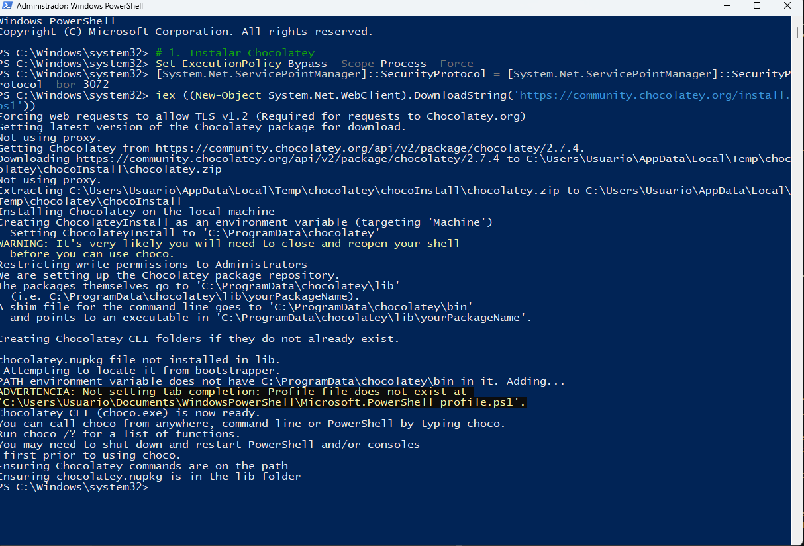

Luego de finalizada la instalación de Chocolatey, procederemos con la instalación de **mkcert**, una herramienta sencilla de código abierto que sirve para crear certificados SSL/TLS de confianza para el desarrollo en entornos locales.

El comando a ejecutar es el siguiente:

```powershell
# 2. Instalar mkcert
choco install mkcert -y
```

```powershell
# 3. Instalar la CA local de mkcert en el sistema/navegador
mkcert -install
```

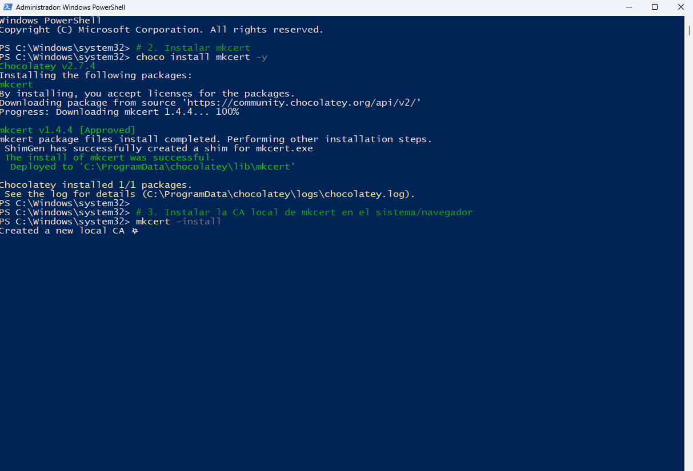

Una vez instalada la herramienta de **mkcert**, abriremos la página creada para evidenciar que no se posee un certificado previo configurado.

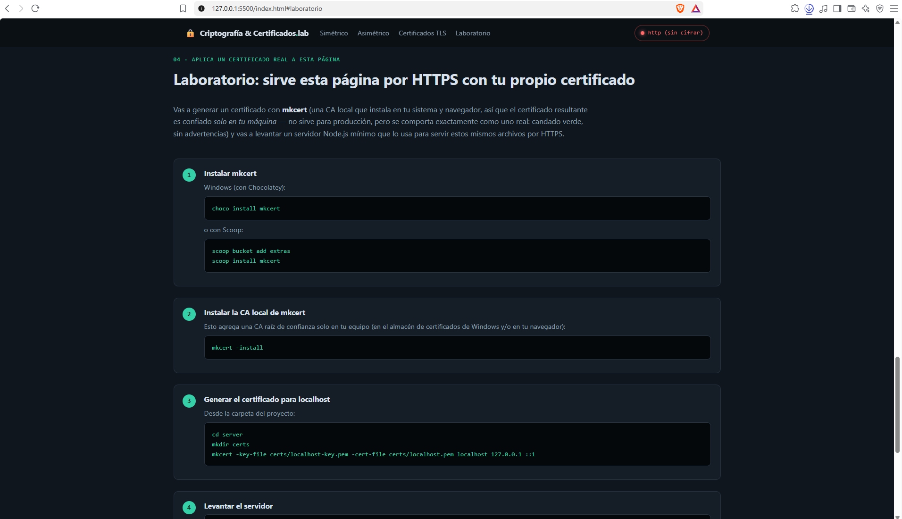

Ahora procederemos a escribir la misma página, pero con el protocolo seguro https.

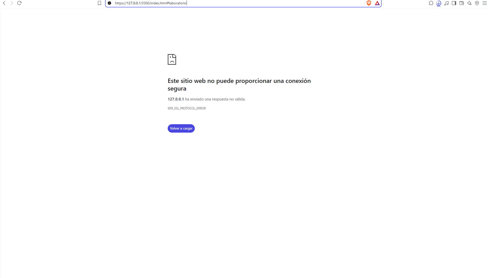

Como podemos ver, no es posible acceder al contenido de manera segura, ya que no poseemos el respectivo certificado.

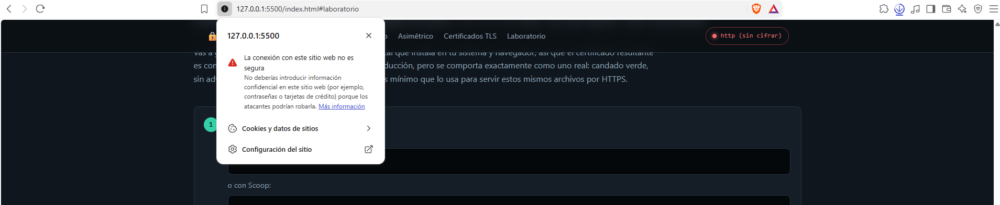

Vamos a continuar con el proceso de generación de certificado, para la ruta de localhost.

Iremos entonces a la carpeta donde tenemos nuestro `index.html`, en nuestro caso la ruta es:

```powershell
cd "C:\Users\Usuario\Desktop\U.Tecnologica\Seguridad del Software\Certificado Digital"
```

Vamos a PowerShell o CMD y escribimos esta ruta.

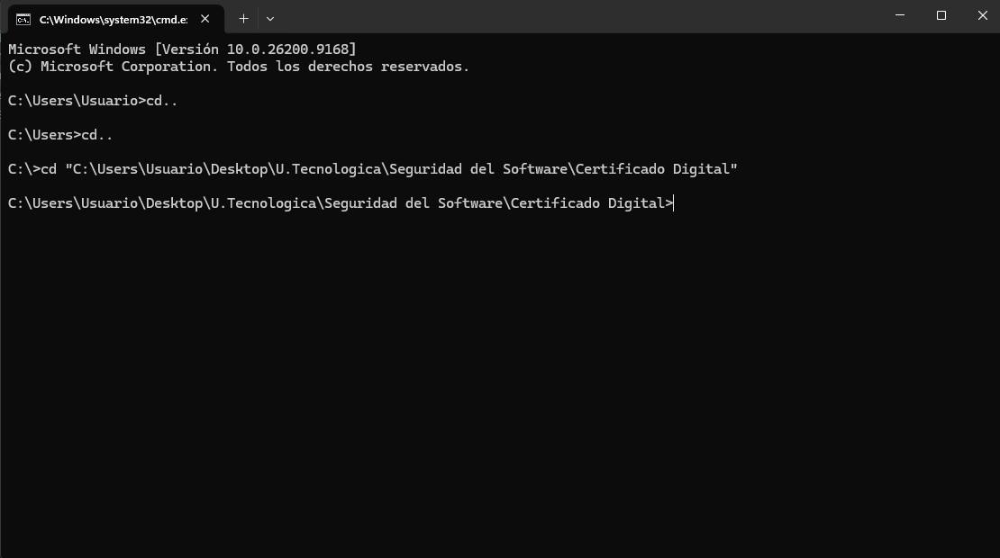

Una vez dentro de la carpeta procederemos a entrar a la carpeta `server` y crearemos la carpeta `certs` con el comando:

```powershell
mkdir certs
```

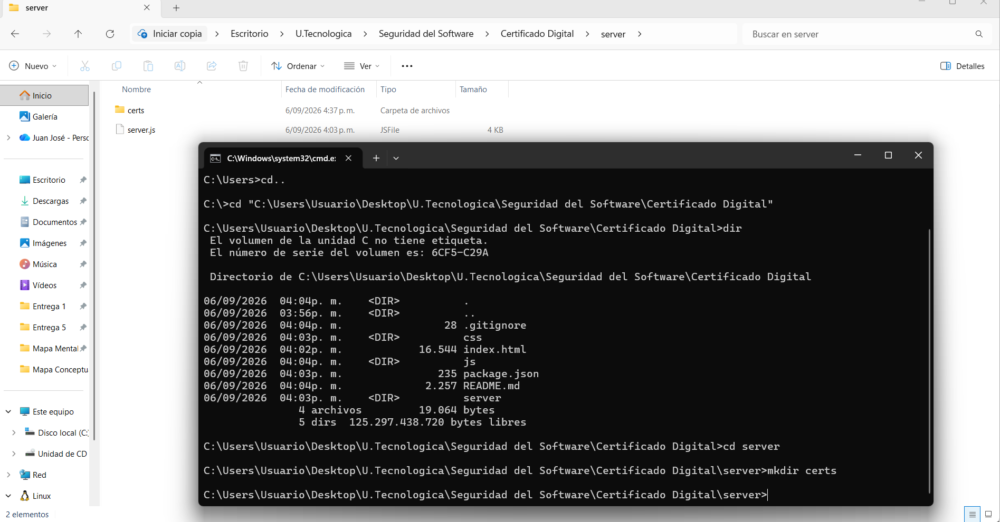

Procederemos entonces a crear el certificado correspondiente para el sitio, con el siguiente comando:

```powershell
# 6. Generar el certificado para localhost
mkcert -key-file certs/localhost-key.pem -cert-file certs/localhost.pem localhost 127.0.0.1 ::1
```

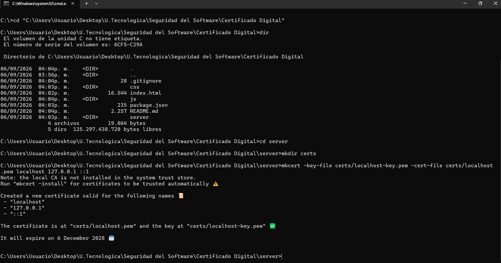

El mismo cmd nos confirma que el certificado fue emitido correctamente.

Volvemos a la carpeta raíz, donde está nuestro `index.html`, y procederemos a levantar el proyecto nuevamente con el comando:

```powershell
npm start
```

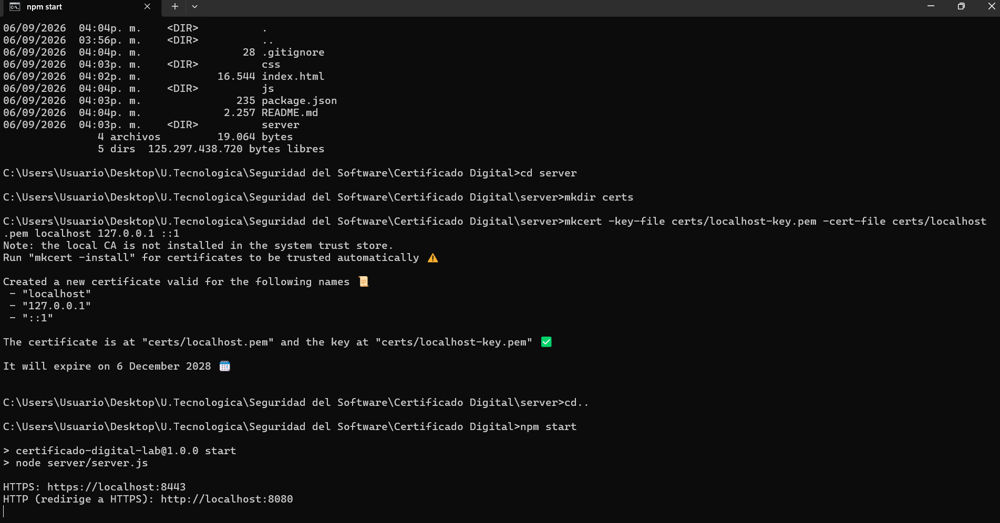

Ya se nos indica que nuestra página se encuentra escuchando en **https://localhost:8443**.

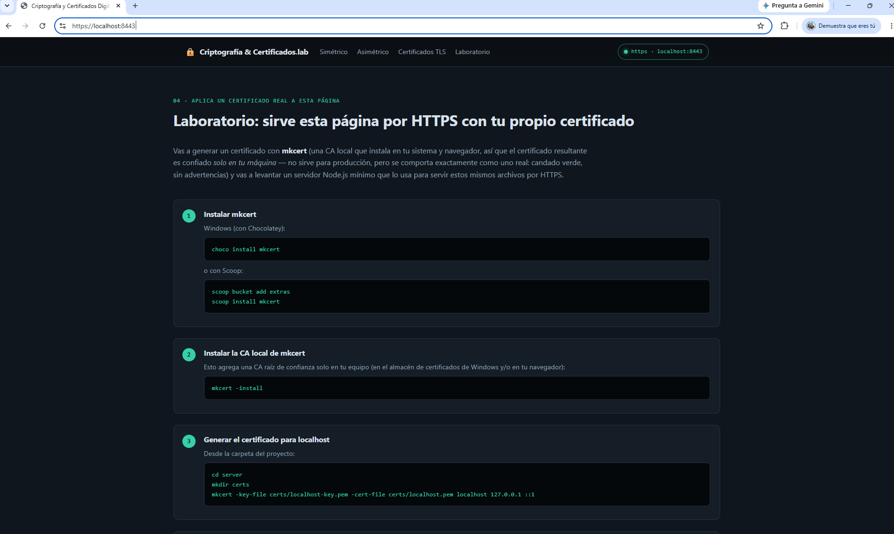

Ya tenemos instalado el certificado correspondiente para nuestra página, es un sitio seguro en el cual poder navegar con confianza.

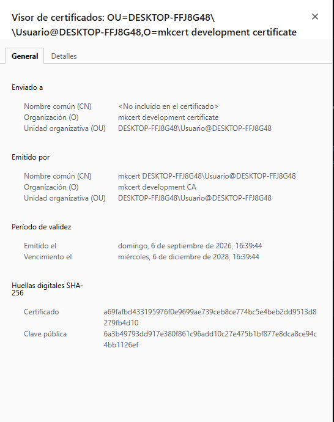

### Elaborado por: Juan Camilo Giraldo Valencia
